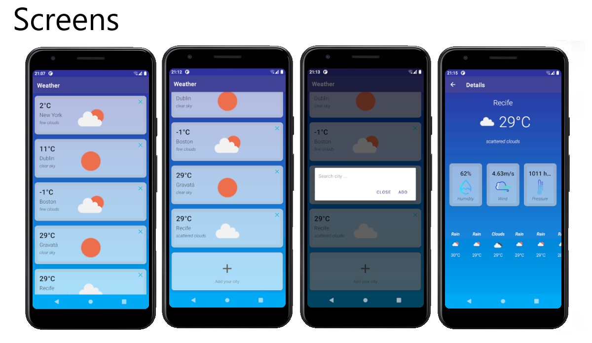

# Kotlin Weather App

App shows the current weather of 5 cities from Open Weather API. Users can add cities and remove them as well and see weather details.

To run the app clone the repository or download the zip file. Open the project on Android Studio and press the run button.

